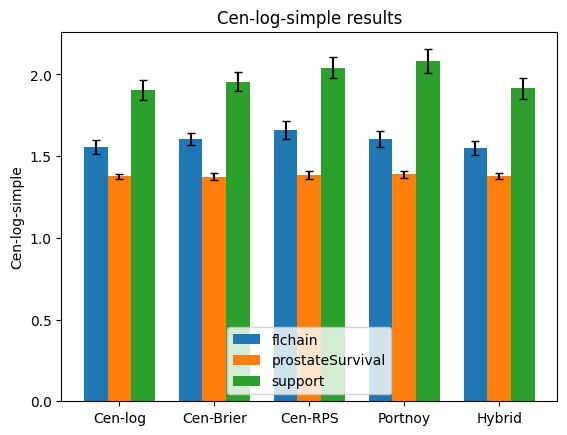
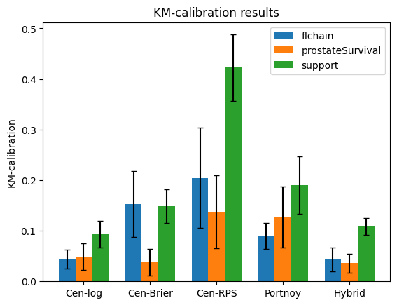
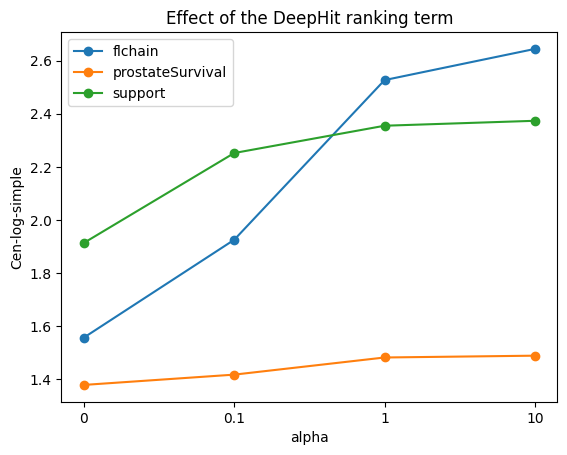

# Proper Scoring Rules for Survival Analysis — A Reproduction

Reproduction of **Yanagisawa (2023), *Proper Scoring Rules for Survival Analysis*, ICML 2023** on three public clinical survival datasets, with a small extension (a Hybrid loss).

The project asks a practical biostatistics question: **when we train a model to predict the full distribution of a patient's event time from right-censored data, which training loss gives predictions that are both accurate and well calibrated?** The paper extends four classical scoring rules to censored data and shows that they are proper. This repository re-implements all four in PyTorch, trains them on the paper's three datasets, and compares the results with the numbers reported in the paper.

> Course project — *Advanced Statistical Machine Learning* (MSc), Spring 2026
> Author: **Saba Naji**

---

## Contents

- [Background](#background)
- [Methods implemented](#methods-implemented)
- [Datasets](#datasets)
- [Experimental setup](#experimental-setup)
- [Results](#results)
- [Repository structure](#repository-structure)
- [How to run](#how-to-run)
- [Differences from the paper](#differences-from-the-paper)
- [Course deliverables](#course-deliverables)
- [References](#references)

---

## Background

In survival analysis we often do not observe the event time for every patient: some patients leave the study or are still alive at the end, so we only know that their event happened *after* a censoring time. A model that outputs a whole predicted distribution of the event time is useful for clinical risk communication, but it must be trained and evaluated with a loss that stays **proper** under censoring — the loss should be minimised by the true distribution, otherwise the model is rewarded for being miscalibrated.

Yanagisawa (2023) extends four scoring rules to right-censored data and trains them with an iterative reweighting (IR) algorithm, where the weight of each censored patient is estimated from the current model.

## Methods implemented

The event-time range is split into `B = 32` bins, and a neural network outputs a probability for each bin.

| Method | Idea | Model output |
|---|---|---|
| **Cen-log** | censored logarithmic score (Eq. 4 of the paper) | 32 bin probabilities (softmax) |
| **Cen-Brier** | censored Brier score (Eq. 8) | 32 bin probabilities |
| **Cen-RPS** | censored ranked probability score (Eq. 9) | 32 bin probabilities |
| **Portnoy** | censored pinball loss / quantile regression | 31 increasing quantiles |
| **Hybrid** *(extension)* | `0.5 · Cen-log + 0.5 · Cen-Brier` | 32 bin probabilities |
| Cen-log-simple | simplified log score (Eq. 5), used for the `B` study | 32 bin probabilities |
| DeepHit | Cen-log-simple + ranking term weighted by `alpha` (improper baseline) | 32 bin probabilities |

**Evaluation metrics** (lower is better for all three):

- **Cen-log-simple** — the paper's main score for discrimination / sharpness;
- **KM-calibration** — KL divergence between the Kaplan–Meier event distribution of the test set and the average predicted distribution;
- **D-calibration deviation** — a simple 20-bin deviation from uniformity of the predicted survival probabilities (my own simplified version, used only to compare models with each other).

## Datasets

The three datasets used in the paper, exported from R packages to CSV (see [`data/README.md`](data/README.md)):

| Dataset | R package | Rows used | Features* | Censoring rate | Max time |
|---|---|---:|---:|---:|---:|
| `flchain` | `survival` | 6,524 | 8 | 69.9% | 5,166 days |
| `prostateSurvival` | `asaur` | 14,294 | 6 | 71.7% | 119 months |
| `support` | `casebase` | 9,104 | 44 | 31.9% | 2,029 days |

\*after one-hot encoding of categorical variables.

Preprocessing: rows with missing `creatinine` and the `chapter` column (a cause-of-death variable, which would leak the outcome) are removed from `flchain`; `slos` is removed from `support`; in `prostateSurvival` any death (`status > 0`) is the event. Missing numeric values are imputed with the median, categorical variables are dummy-coded, and predictors are standardised using the training split only.

## Experimental setup

- Network: 3 hidden layers × 128 units, ReLU, softmax output (as in the paper)
- Optimiser: Adam, learning rate 0.001, full-batch training
- 75 epochs (the paper uses 300); the validation split is checked every 25 epochs and the best checkpoint is kept
- 5 random stratified 60/20/20 train/validation/test splits; the same splits are used for every method
- The `B` study and the DeepHit `alpha` study use 3 splits
- CPU only; Python 3.14, PyTorch 2.12.1

## Results

All numbers are **mean ± standard deviation on the test sets over 5 random splits**. Lower is better.

### Main comparison — Cen-log-simple

| Method | flchain | prostateSurvival | support |
|---|---:|---:|---:|
| Cen-log | 1.558 ± 0.043 | 1.376 ± 0.016 | **1.905 ± 0.059** |
| Cen-Brier | 1.604 ± 0.036 | **1.375 ± 0.019** | 1.955 ± 0.059 |
| Cen-RPS | 1.660 ± 0.058 | 1.387 ± 0.024 | 2.042 ± 0.063 |
| Portnoy | 1.605 ± 0.047 | 1.389 ± 0.023 | 2.080 ± 0.074 |
| Hybrid *(extension)* | **1.550 ± 0.043** | 1.376 ± 0.018 | 1.915 ± 0.066 |

### KM-calibration

| Method | flchain | prostateSurvival | support |
|---|---:|---:|---:|
| Cen-log | 0.044 ± 0.019 | 0.049 ± 0.027 | **0.094 ± 0.026** |
| Cen-Brier | 0.153 ± 0.065 | 0.038 ± 0.026 | 0.149 ± 0.033 |
| Cen-RPS | 0.204 ± 0.099 | 0.137 ± 0.073 | 0.422 ± 0.065 |
| Portnoy | 0.090 ± 0.026 | 0.127 ± 0.060 | 0.190 ± 0.057 |
| Hybrid *(extension)* | **0.043 ± 0.024** | **0.036 ± 0.019** | 0.108 ± 0.016 |

<p align="center">
  
  
</p>

### Comparison with the paper (Cen-log, `B = 32`, Appendix Table 4)

| Dataset | This reproduction | Paper | Difference |
|---|---:|---:|---:|
| flchain | 1.5581 ± 0.0427 | 1.5054 ± 0.0508 | 0.053 |
| prostateSurvival | 1.3760 ± 0.0161 | 1.3608 ± 0.0295 | 0.015 |
| support | 1.9051 ± 0.0592 | 1.8307 ± 0.0452 | 0.074 |

### DeepHit ranking parameter `alpha` (Cen-log-simple, 3 splits)

| `alpha` | flchain | prostateSurvival | support |
|---:|---:|---:|---:|
| 0 | **1.5577** | **1.3794** | **1.9140** |
| 0.1 | 1.9258 | 1.4182 | 2.2522 |
| 1 | 2.5266 | 1.4826 | 2.3549 |
| 10 | 2.6440 | 1.4895 | 2.3735 |

<p align="center">
  
</p>

### Main findings

1. **The paper's ranking reproduced.** Cen-log and Cen-Brier are the strongest of the four proper scoring rules, and Cen-RPS and Portnoy are behind them in discrimination on all three datasets. Cen-log is also well calibrated everywhere, while Cen-RPS is the worst calibrated. As the paper explains, the IR weights of Cen-log and Cen-Brier are usually close to 0 or 1, while those of Cen-RPS and Portnoy can take any value and are harder to estimate.
2. **Cen-log values are close to the paper.** The differences (0.015–0.074) are within about one to two of the paper's standard deviations, despite fewer epochs and a different preprocessing pipeline.
3. **The improper ranking term hurts.** For DeepHit, Cen-log-simple and KM-calibration get worse as `alpha` grows on every dataset, so `alpha = 0` (a proper score) is best — the same trend as Table 1 of the paper.
4. **Exact vs. simplified Cen-log.** For `B = 8` and `16` the exact Cen-log (Eq. 4) is clearly better calibrated than the simplified version (Eq. 5); at `B = 32` the two become very similar, which supports the paper's advice to use `B > 16`.
5. **Hybrid extension.** Mixing Cen-log and Cen-Brier gives results in the same range as the better of the two, but no clear improvement across all datasets.

## Repository structure

```
survival-proper-scoring-rules/
├── README.md
├── LICENSE
├── requirements.txt
├── data/
│   ├── README.md                 # source and export code of each dataset
│   ├── flchain.csv
│   ├── prostateSurvival.csv
│   └── support.csv
├── notebooks/
│   └── proper_scoring_rules_survival.ipynb   # full implementation, executed with outputs
├── figures/                      # plots exported from the notebook
│   ├── cen_log_simple.png
│   ├── km_calibration.png
│   ├── d_calibration.png
│   └── deephit_alpha.png
└── docs/
    ├── implementation_report.pdf # method, experiments and results (11 pages)
    ├── research_report.pdf       # backward / forward citation study of the paper (8 pages)
    ├── paper_analysis.xlsx       # screening of 100 survival-analysis papers
    └── paper_analysis.csv        # the same table as CSV (viewable on GitHub)
```

## How to run

```bash
git clone https://github.com/sabanaji1014-cloud/survival-proper-scoring-rules.git
cd survival-proper-scoring-rules
pip install -r requirements.txt
cd notebooks
jupyter notebook proper_scoring_rules_survival.ipynb
```

The notebook reads the data from `../data/`, so start Jupyter from inside `notebooks/`. It runs on a CPU; the full run (Sections 9, 17 and 18) takes a while because every model is trained several times. For a quick check, lower `runs`, `small_runs` and `epochs` in the first code cell. Seeds are fixed, but small numerical differences between machines and library versions are possible.

## Differences from the paper

- 75 training epochs instead of 300, with the validation split used to keep the best checkpoint.
- The paper does not fully describe its feature preprocessing, so a simple, transparent pipeline is used here.
- Full-batch training instead of mini-batches.
- D-calibration is a simplified deviation statistic, not the exact statistic of the original code.
- Portnoy uses a simple grid estimate of the censoring quantile.
- The DRSA, S-CRPS and IPCW baselines of Figure 4 are not implemented; DeepHit with `alpha > 0` serves as the improper baseline.
- The `B` and `alpha` studies use 3 splits instead of 5.

## Course deliverables

The project had four parts; all of them are in [`docs/`](docs/):

1. **Paper analysis** — 100 papers on survival and time-to-event learning from NeurIPS, ICML, JMLR and *Machine Learning*, screened for compute cost and reproducibility ([xlsx](docs/paper_analysis.xlsx) · [csv](docs/paper_analysis.csv)).
2. **Research report** — backward and forward citation study of the selected paper ([PDF](docs/research_report.pdf)).
3. **Implementation** — this notebook ([notebook](notebooks/proper_scoring_rules_survival.ipynb)).
4. **Implementation report** — full description of the method, experiments and results ([PDF](docs/implementation_report.pdf)).

## References

- Yanagisawa, H. (2023). Proper Scoring Rules for Survival Analysis. *Proceedings of the 40th International Conference on Machine Learning (ICML)*, PMLR 202. [arXiv:2305.00621](https://arxiv.org/abs/2305.00621)
- Lee, C., Zame, W., Yoon, J., & van der Schaar, M. (2018). DeepHit: A Deep Learning Approach to Survival Analysis with Competing Risks. *AAAI*.
- Haider, H., Hoehn, B., Davis, S., & Greiner, R. (2020). Effective Ways to Build and Evaluate Individual Survival Distributions. *JMLR*, 21(85).
- Portnoy, S. (2003). Censored Regression Quantiles. *Journal of the American Statistical Association*, 98(464).

## License

The code is released under the [MIT License](LICENSE). The datasets belong to their original sources (see [`data/README.md`](data/README.md)).
